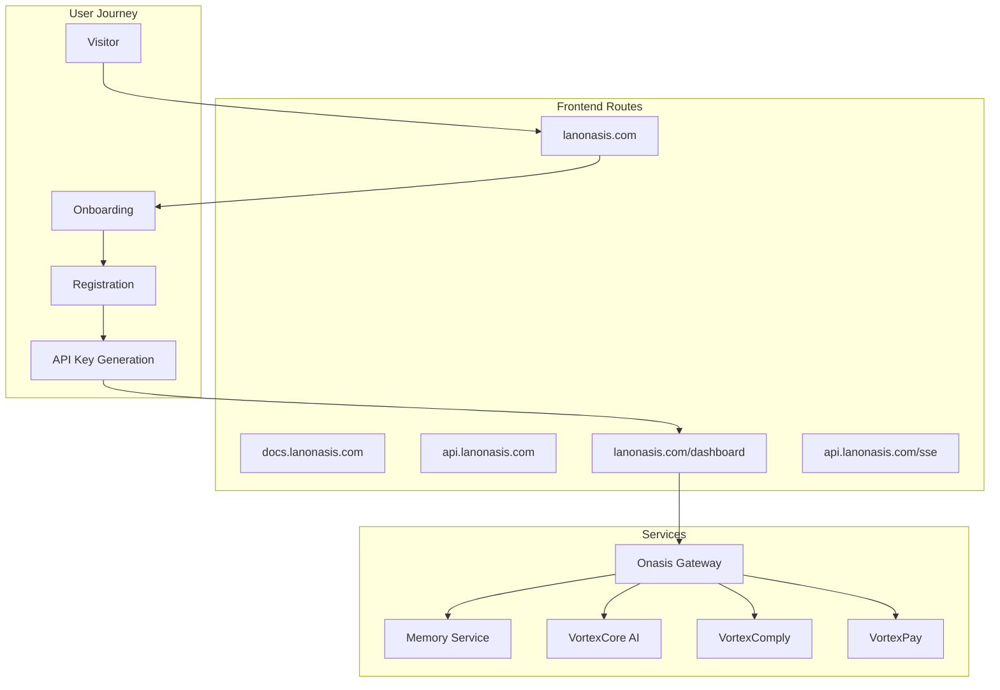

# 🚀 Lanonasis.com Frontend Upgrade Plan

## Executive Summary

Upgrade the lanonasis.com website to integrate Memory as a Service (MaaS) and create a seamless onboarding flow that captures users and generates API keys for platform access.

## 🎯 Objectives

1. **Service Integration** - Connect all Lanonasis services through unified navigation
2. **API Key Onboarding** - Streamline user registration and API key generation
3. **Developer Portal** - Create comprehensive documentation at docs.lanonasis.com
4. **Dashboard Access** - Implement authenticated dashboard at lanonasis.com/dashboard
5. **Traffic Capture** - Convert website visitors into platform users

## 🏗️ Architecture Overview



## 📋 Current State Analysis

### Existing Features
- ✅ VortexCore AI ecosystem highlighted
- ✅ 18+ services in Onasis-Gateway
- ✅ Multi-language support
- ✅ African market focus
- ✅ Social media presence

### Missing Components
- ❌ API key generation flow
- ❌ Developer documentation portal
- ❌ User dashboard
- ❌ Service navigation/redirects
- ❌ Memory Service integration
- ❌ SSE endpoint documentation

## 🛠️ Implementation Plan

### Phase 1: Homepage Enhancement

#### 1.1 Navigation Update
```jsx
// components/Navigation.jsx
const Navigation = () => {
  return (
    <nav className="navbar">
      <div className="nav-links">
        <Link href="/">Home</Link>
        <Link href="/products">Products</Link>
        <Link href="/developers">Developers</Link>
        <Link href="https://docs.lanonasis.com">Documentation</Link>
        <Link href="/pricing">Pricing</Link>
        <Link href="/dashboard" className="btn-primary">Dashboard</Link>
        <Link href="/get-started" className="btn-cta">Get API Key</Link>
      </div>
    </nav>
  );
};
```

#### 1.2 Hero Section with CTA
```jsx
// components/HeroSection.jsx
const HeroSection = () => {
  return (
    <section className="hero">
      <h1>AI-Powered Financial Infrastructure for Africa</h1>
      <p>Access 1000+ APIs including Memory as a Service, VortexCore AI, and more</p>
      <div className="cta-buttons">
        <Link href="/get-started" className="btn-primary">
          Start Free Trial
        </Link>
        <Link href="/demo" className="btn-secondary">
          Request Demo
        </Link>
      </div>
      <div className="quick-links">
        <a href="https://api.lanonasis.com">API Status</a>
        <a href="https://docs.lanonasis.com">Documentation</a>
        <a href="/dashboard">Dashboard</a>
      </div>
    </section>
  );
};
```

#### 1.3 Service Cards with Memory Service
```jsx
// components/ServiceCards.jsx
const services = [
  {
    id: 'memory',
    name: 'Memory as a Service',
    description: 'Vector-based memory storage with AI search',
    icon: '🧠',
    url: '/products/memory',
    apiEndpoint: 'https://api.lanonasis.com/api/v1/memory',
    features: ['Semantic Search', 'Vector Storage', 'MCP Integration', 'IDE Extensions']
  },
  {
    id: 'vortexcore',
    name: 'VortexCore AI',
    description: 'Intelligent business assistant',
    icon: '🤖',
    url: '/products/vortexcore',
    features: ['AI Analytics', 'Business Insights', 'Automation']
  },
  // ... other services
];
```

### Phase 2: Onboarding Flow

#### 2.1 Registration Page
```jsx
// pages/get-started.jsx
import { useState } from 'react';
import { useRouter } from 'next/router';

const GetStarted = () => {
  const [step, setStep] = useState(1);
  const router = useRouter();
  
  const steps = [
    { id: 1, title: 'Create Account', component: <CreateAccountForm /> },
    { id: 2, title: 'Choose Plan', component: <PricingSelection /> },
    { id: 3, title: 'Generate API Key', component: <APIKeyGeneration /> },
    { id: 4, title: 'Setup Complete', component: <OnboardingComplete /> }
  ];
  
  return (
    <div className="onboarding-flow">
      <ProgressBar currentStep={step} totalSteps={4} />
      {steps[step - 1].component}
    </div>
  );
};
```

#### 2.2 API Key Generation Component
```jsx
// components/APIKeyGeneration.jsx
const APIKeyGeneration = ({ userId }) => {
  const [apiKey, setApiKey] = useState(null);
  const [loading, setLoading] = useState(false);
  
  const generateAPIKey = async () => {
    setLoading(true);
    try {
      const response = await fetch('/api/generate-key', {
        method: 'POST',
        headers: {
          'Authorization': `Bearer ${token}`,
          'Content-Type': 'application/json'
        },
        body: JSON.stringify({ 
          name: 'Default API Key',
          permissions: ['read', 'write'],
          services: ['memory', 'gateway']
        })
      });
      
      const data = await response.json();
      setApiKey(data.apiKey);
      
      // Track conversion
      analytics.track('API_Key_Generated', {
        userId,
        plan: data.plan
      });
    } catch (error) {
      console.error('Failed to generate API key:', error);
    }
    setLoading(false);
  };
  
  return (
    <div className="api-key-section">
      <h2>Generate Your API Key</h2>
      <p>Your API key provides access to all Lanonasis services</p>
      
      {!apiKey ? (
        <button onClick={generateAPIKey} disabled={loading}>
          {loading ? 'Generating...' : 'Generate API Key'}
        </button>
      ) : (
        <div className="api-key-display">
          <code>{apiKey}</code>
          <button onClick={() => copyToClipboard(apiKey)}>Copy</button>
          <Alert>
            Save this key securely. You won't be able to see it again.
          </Alert>
        </div>
      )}
      
      <div className="next-steps">
        <h3>Next Steps:</h3>
        <ul>
          <li>Install the CLI: <code>npm install -g @lanonasis/cli</code></li>
          <li>Install the SDK: <code>npm install @lanonasis/memory-client</code></li>
          <li>Read the <a href="https://docs.lanonasis.com">documentation</a></li>
          <li>Access your <a href="/dashboard">dashboard</a></li>
        </ul>
      </div>
    </div>
  );
};
```

### Phase 3: Dashboard Implementation

#### 3.1 Dashboard Layout
```jsx
// pages/dashboard/index.jsx
import { DashboardLayout } from '@/components/layouts/DashboardLayout';
import { MemoryWidget } from '@/components/widgets/MemoryWidget';
import { APIUsageWidget } from '@/components/widgets/APIUsageWidget';
import { QuickStartWidget } from '@/components/widgets/QuickStartWidget';

const Dashboard = () => {
  return (
    <DashboardLayout>
      <div className="dashboard-header">
        <h1>Welcome to Lanonasis Dashboard</h1>
        <div className="quick-actions">
          <Link href="/dashboard/memory">Memory Service</Link>
          <Link href="/dashboard/api-keys">API Keys</Link>
          <Link href="/dashboard/billing">Billing</Link>
        </div>
      </div>
      
      <div className="dashboard-grid">
        <MemoryWidget />
        <APIUsageWidget />
        <QuickStartWidget />
        <ServiceStatusWidget />
      </div>
    </DashboardLayout>
  );
};
```

#### 3.2 Memory Service Dashboard
```jsx
// pages/dashboard/memory.jsx
const MemoryDashboard = () => {
  return (
    <DashboardLayout>
      <div className="memory-dashboard">
        <MemoryStats />
        <MemorySearch />
        <RecentMemories />
        <MemoryVisualizer />
        <BulkUploadCenter />
      </div>
    </DashboardLayout>
  );
};
```

### Phase 4: Developer Portal (docs.lanonasis.com)

#### 4.1 Documentation Structure
```
docs.lanonasis.com/
├── getting-started/
│   ├── quickstart.md
│   ├── authentication.md
│   └── first-api-call.md
├── api-reference/
│   ├── memory-service/
│   ├── gateway/
│   └── sse-events/
├── sdks/
│   ├── javascript.md
│   ├── python.md
│   └── cli.md
├── guides/
│   ├── mcp-integration.md
│   ├── ide-extensions.md
│   └── best-practices.md
└── examples/
    ├── memory-search.md
    ├── bulk-operations.md
    └── real-time-sync.md
```

#### 4.2 Interactive API Explorer
```jsx
// components/APIExplorer.jsx
const APIExplorer = () => {
  const [selectedEndpoint, setSelectedEndpoint] = useState(null);
  const [apiKey, setApiKey] = useState('');
  const [response, setResponse] = useState(null);
  
  return (
    <div className="api-explorer">
      <div className="endpoint-list">
        {endpoints.map(endpoint => (
          <EndpointCard 
            key={endpoint.id}
            endpoint={endpoint}
            onClick={() => setSelectedEndpoint(endpoint)}
          />
        ))}
      </div>
      
      <div className="try-it-out">
        <input 
          type="text" 
          placeholder="Enter your API key"
          value={apiKey}
          onChange={(e) => setApiKey(e.target.value)}
        />
        <RequestBuilder endpoint={selectedEndpoint} />
        <ResponseViewer response={response} />
      </div>
    </div>
  );
};
```

### Phase 5: Service Redirects & Routing

#### 5.1 Next.js Routing Configuration
```javascript
// next.config.js
module.exports = {
  async redirects() {
    return [
      {
        source: '/api',
        destination: 'https://api.lanonasis.com',
        permanent: false,
      },
      {
        source: '/docs',
        destination: 'https://docs.lanonasis.com',
        permanent: false,
      },
      {
        source: '/memory',
        destination: '/dashboard/memory',
        permanent: false,
      },
    ];
  },
  async rewrites() {
    return [
      {
        source: '/api/:path*',
        destination: 'https://api.lanonasis.com/:path*',
      },
      {
        source: '/sse/:path*',
        destination: 'https://api.lanonasis.com/sse/:path*',
      },
    ];
  },
};
```

#### 5.2 Service Navigation Component
```jsx
// components/ServiceNavigator.jsx
const ServiceNavigator = () => {
  const services = [
    { name: 'Memory Service', url: '/dashboard/memory', icon: '🧠' },
    { name: 'API Gateway', url: 'https://api.lanonasis.com', icon: '🌐' },
    { name: 'Documentation', url: 'https://docs.lanonasis.com', icon: '📚' },
    { name: 'SSE Events', url: '/dashboard/sse', icon: '📡' },
    { name: 'VortexCore', url: '/dashboard/vortexcore', icon: '🤖' },
  ];
  
  return (
    <div className="service-navigator">
      {services.map(service => (
        <ServiceCard key={service.name} {...service} />
      ))}
    </div>
  );
};
```

## 🎨 UI/UX Considerations

### Design System Updates
```scss
// styles/design-system.scss
:root {
  // Brand Colors
  --primary: #1a73e8;       // Lanonasis Blue
  --secondary: #34a853;     // Success Green
  --accent: #fbbc04;        // Warning Yellow
  --danger: #ea4335;        // Error Red
  
  // Memory Service Colors
  --memory-primary: #6b46c1; // Purple for AI/Memory
  --memory-secondary: #a78bfa;
  
  // Typography
  --font-primary: 'Inter', sans-serif;
  --font-mono: 'JetBrains Mono', monospace;
}

// Component Styles
.service-card {
  background: var(--card-bg);
  border: 1px solid var(--border-color);
  border-radius: 12px;
  padding: 24px;
  transition: all 0.3s ease;
  
  &:hover {
    transform: translateY(-4px);
    box-shadow: 0 12px 24px rgba(0, 0, 0, 0.1);
  }
  
  &.memory-service {
    border-top: 4px solid var(--memory-primary);
  }
}

.api-key-display {
  background: var(--code-bg);
  border: 1px solid var(--border-color);
  border-radius: 8px;
  padding: 16px;
  font-family: var(--font-mono);
  display: flex;
  align-items: center;
  gap: 12px;
  
  code {
    flex: 1;
    user-select: all;
  }
}
```

## 📊 Analytics & Tracking

### Conversion Funnel
```javascript
// utils/analytics.js
export const trackOnboarding = {
  pageView: (page) => {
    gtag('event', 'page_view', {
      page_title: page,
      page_location: window.location.href,
      page_path: window.location.pathname,
    });
  },
  
  signupStarted: () => {
    gtag('event', 'sign_up_started', {
      method: 'email',
    });
  },
  
  signupCompleted: (userId) => {
    gtag('event', 'sign_up', {
      user_id: userId,
    });
  },
  
  apiKeyGenerated: (plan) => {
    gtag('event', 'api_key_generated', {
      plan: plan,
      value: plan === 'pro' ? 29 : 0,
      currency: 'USD',
    });
  },
  
  firstApiCall: (service) => {
    gtag('event', 'first_api_call', {
      service: service,
    });
  },
};
```

## 🚀 Implementation Timeline

### Week 1: Foundation
- [ ] Update navigation and routing
- [ ] Create onboarding flow UI
- [ ] Implement registration page
- [ ] Setup analytics tracking

### Week 2: Core Features
- [ ] Build API key generation
- [ ] Create dashboard layout
- [ ] Implement memory service page
- [ ] Add service navigation

### Week 3: Developer Experience
- [ ] Launch docs.lanonasis.com
- [ ] Create API explorer
- [ ] Write getting started guides
- [ ] Add code examples

### Week 4: Polish & Launch
- [ ] UI/UX refinements
- [ ] Performance optimization
- [ ] Testing and QA
- [ ] Deployment and monitoring

## 📈 Success Metrics

### Key Performance Indicators
1. **Conversion Rate**: Visitors → Registered Users (Target: 5%)
2. **API Key Generation**: Registered → Active (Target: 80%)
3. **First API Call**: Within 24 hours (Target: 60%)
4. **Documentation Engagement**: Page views per user (Target: 10+)
5. **Dashboard Usage**: Weekly active users (Target: 70%)

### Tracking Implementation
```javascript
// Track user journey
const userJourney = {
  landingPage: Date.now(),
  registrationStarted: null,
  registrationCompleted: null,
  apiKeyGenerated: null,
  firstApiCall: null,
  dashboardAccessed: null,
};
```

## 🔗 Technical Integration Points

### API Endpoints Required
```typescript
// Backend endpoints needed
POST   /api/auth/register
POST   /api/auth/login
POST   /api/auth/refresh
POST   /api/keys/generate
GET    /api/keys/list
DELETE /api/keys/:id
GET    /api/usage/stats
GET    /api/billing/usage
POST   /api/billing/upgrade
```

### SSE Integration
```javascript
// SSE connection for real-time updates
const connectSSE = (apiKey) => {
  const eventSource = new EventSource(
    `https://api.lanonasis.com/sse?key=${apiKey}`
  );
  
  eventSource.addEventListener('memory.created', (event) => {
    const data = JSON.parse(event.data);
    updateMemoryList(data);
  });
  
  eventSource.addEventListener('usage.update', (event) => {
    const data = JSON.parse(event.data);
    updateUsageStats(data);
  });
  
  return eventSource;
};
```

## 🎯 Next Steps

1. **Review and approve** the upgrade plan
2. **Set up development environment** for frontend work
3. **Create design mockups** for key pages
4. **Begin implementation** with Phase 1
5. **Coordinate with backend team** for API endpoints
6. **Plan marketing campaign** for launch

This comprehensive upgrade will transform lanonasis.com from a static website into a dynamic platform that captures users, generates revenue, and provides seamless access to all Lanonasis services.