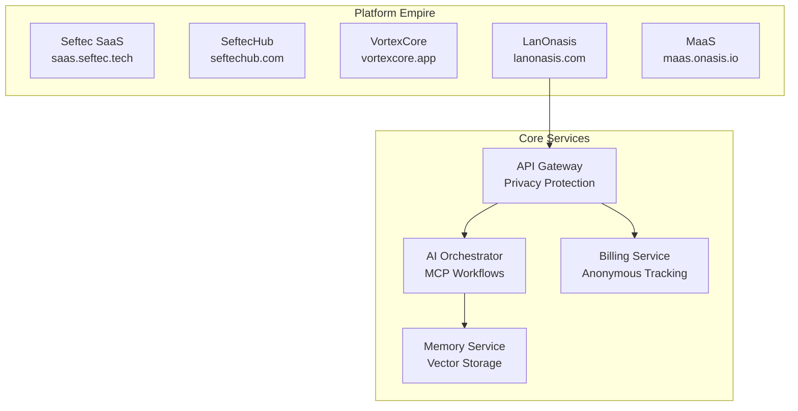

# 🌍 Onasis-CORE Aligned Frontend Implementation Plan

## Executive Summary

Align the lanonasis.com frontend with the Onasis-CORE architecture, incorporating:
- Privacy-first API Gateway integration
- MCP-powered AI orchestration
- Multi-platform empire management
- Intelligent workflow automation
- Memory Service as a flagship feature

## 🏗️ Architecture Alignment

### Current Onasis-CORE Services



## 🚀 Implementation Phases

### Phase 1: Gateway Integration & Privacy Features

#### 1.1 Update API Client with Privacy Headers

```typescript
// lib/api/onasis-gateway-client.ts
import { createMemoryClient } from '@/lib/memory/client';

export class OnasisGatewayClient {
  private baseURL: string;
  private apiKey: string;
  private anonymousId: string;
  
  constructor(config: OnasisConfig) {
    this.baseURL = config.gatewayUrl || 'https://api.vortexai.io';
    this.apiKey = config.apiKey;
    this.anonymousId = this.generateAnonymousId();
  }
  
  private generateAnonymousId(): string {
    return `anon_${Date.now()}_${Math.random().toString(36).substr(2, 9)}`;
  }
  
  async request(endpoint: string, options: RequestInit = {}) {
    const headers = {
      'Content-Type': 'application/json',
      'Authorization': `Bearer ${this.apiKey}`,
      'X-Anonymous-ID': this.anonymousId,
      'X-Privacy-Level': 'high',
      'X-Platform': 'lanonasis',
      ...options.headers
    };
    
    const response = await fetch(`${this.baseURL}${endpoint}`, {
      ...options,
      headers
    });
    
    // Extract billing metadata
    const billingInfo = response.headers.get('X-Billing-Info');
    if (billingInfo) {
      this.updateUsageDisplay(JSON.parse(billingInfo));
    }
    
    return response.json();
  }
  
  private updateUsageDisplay(billing: BillingInfo) {
    // Update UI with anonymous usage tracking
    window.dispatchEvent(new CustomEvent('usage:update', { 
      detail: billing 
    }));
  }
}
```

#### 1.2 Privacy-First UI Components

```typescript
// components/privacy/PrivacyIndicator.tsx
export function PrivacyIndicator() {
  const [privacyLevel, setPrivacyLevel] = useState('high');
  const [anonymousMode, setAnonymousMode] = useState(true);
  
  return (
    <div className="privacy-indicator">
      <Shield className="w-4 h-4 text-green-500" />
      <span className="text-xs">
        {anonymousMode ? 'Anonymous' : 'Identified'} • {privacyLevel} privacy
      </span>
      <Tooltip>
        <TooltipTrigger>
          <Info className="w-3 h-3" />
        </TooltipTrigger>
        <TooltipContent>
          <p>Your data is protected by Onasis-CORE privacy layer</p>
          <ul className="text-xs mt-2">
            <li>• Vendor identity masked</li>
            <li>• PII automatically removed</li>
            <li>• Anonymous usage tracking</li>
            <li>• End-to-end encryption</li>
          </ul>
        </TooltipContent>
      </Tooltip>
    </div>
  );
}
```

### Phase 2: MCP Orchestration Integration

#### 2.1 AI Workflow Builder UI

```typescript
// components/orchestrator/WorkflowBuilder.tsx
import { useState } from 'react';
import { Card, CardContent, CardHeader, CardTitle } from '@/components/ui/card';
import { Button } from '@/components/ui/button';
import { Plus, Play, Save } from 'lucide-react';

export function WorkflowBuilder() {
  const [workflow, setWorkflow] = useState<Workflow>({
    name: '',
    description: '',
    actions: []
  });
  
  const availableActions = [
    {
      id: 'memory_search',
      name: 'Search Memories',
      icon: '🧠',
      params: ['query', 'limit', 'threshold']
    },
    {
      id: 'ai_analysis',
      name: 'AI Analysis',
      icon: '🤖',
      params: ['input', 'analysis_type', 'format']
    },
    {
      id: 'report_generation',
      name: 'Generate Report',
      icon: '📊',
      params: ['data', 'template', 'format']
    },
    {
      id: 'notification',
      name: 'Send Notification',
      icon: '🔔',
      params: ['recipient', 'message', 'channel']
    }
  ];
  
  const executeWorkflow = async () => {
    const response = await fetch('/api/orchestrator/execute', {
      method: 'POST',
      headers: { 'Content-Type': 'application/json' },
      body: JSON.stringify({
        workflow,
        mode: 'intelligent' // Let AI optimize execution
      })
    });
    
    const result = await response.json();
    // Show execution progress in real-time
    showExecutionProgress(result.workflow_id);
  };
  
  return (
    <Card>
      <CardHeader>
        <CardTitle>AI Workflow Builder</CardTitle>
        <p className="text-sm text-muted-foreground">
          Create intelligent workflows that adapt in real-time
        </p>
      </CardHeader>
      <CardContent>
        <div className="space-y-4">
          <Input 
            placeholder="Workflow name"
            value={workflow.name}
            onChange={(e) => setWorkflow({...workflow, name: e.target.value})}
          />
          
          <div className="border rounded-lg p-4">
            <h3 className="font-semibold mb-2">Workflow Actions</h3>
            {workflow.actions.map((action, index) => (
              <WorkflowAction 
                key={index} 
                action={action} 
                onUpdate={(updated) => updateAction(index, updated)}
                onDelete={() => removeAction(index)}
              />
            ))}
            
            <DropdownMenu>
              <DropdownMenuTrigger asChild>
                <Button variant="outline" className="w-full mt-2">
                  <Plus className="w-4 h-4 mr-2" />
                  Add Action
                </Button>
              </DropdownMenuTrigger>
              <DropdownMenuContent>
                {availableActions.map(action => (
                  <DropdownMenuItem 
                    key={action.id}
                    onClick={() => addAction(action)}
                  >
                    <span className="mr-2">{action.icon}</span>
                    {action.name}
                  </DropdownMenuItem>
                ))}
              </DropdownMenuContent>
            </DropdownMenu>
          </div>
          
          <div className="flex gap-2">
            <Button onClick={executeWorkflow} className="flex-1">
              <Play className="w-4 h-4 mr-2" />
              Execute Workflow
            </Button>
            <Button variant="outline" onClick={saveWorkflow}>
              <Save className="w-4 h-4 mr-2" />
              Save Template
            </Button>
          </div>
        </div>
      </CardContent>
    </Card>
  );
}
```

#### 2.2 Workflow Templates Gallery

```typescript
// components/orchestrator/WorkflowTemplates.tsx
const workflowTemplates = [
  {
    id: 'sales_intelligence',
    name: 'Sales Intelligence Report',
    description: 'Analyze sales data and create executive dashboard',
    icon: '📊',
    actions: [
      { type: 'data_extraction', params: { source: 'sales_db' } },
      { type: 'ai_analysis', params: { analysis_type: 'trend' } },
      { type: 'visualization', params: { chart_types: ['revenue', 'conversion'] } },
      { type: 'report_generation', params: { template: 'executive' } },
      { type: 'distribution', params: { channels: ['email', 'slack'] } }
    ],
    estimatedTime: '2-3 minutes',
    cost: '$2.50'
  },
  {
    id: 'customer_support',
    name: 'Smart Customer Support',
    description: 'Handle customer complaints with AI assistance',
    icon: '💬',
    actions: [
      { type: 'sentiment_analysis', params: {} },
      { type: 'account_lookup', params: {} },
      { type: 'issue_resolution', params: { auto_refund: true } },
      { type: 'personalized_response', params: { tone: 'empathetic' } },
      { type: 'follow_up_scheduling', params: { delay: '24h' } }
    ],
    estimatedTime: '30 seconds',
    cost: '$0.75'
  },
  {
    id: 'content_automation',
    name: 'Content Marketing Package',
    description: 'Create and distribute weekly content',
    icon: '✍️',
    actions: [
      { type: 'trend_research', params: { topics: ['AI', 'SaaS'] } },
      { type: 'content_creation', params: { types: ['blog', 'social'] } },
      { type: 'seo_optimization', params: { target_score: 80 } },
      { type: 'multi_platform_publishing', params: {} },
      { type: 'performance_tracking', params: {} }
    ],
    estimatedTime: '5-10 minutes',
    cost: '$5.00'
  }
];

export function WorkflowTemplates() {
  return (
    <div className="grid md:grid-cols-2 lg:grid-cols-3 gap-4">
      {workflowTemplates.map(template => (
        <Card key={template.id} className="hover:shadow-lg transition-shadow">
          <CardHeader>
            <div className="flex items-start justify-between">
              <div>
                <h3 className="font-semibold flex items-center gap-2">
                  <span className="text-2xl">{template.icon}</span>
                  {template.name}
                </h3>
                <p className="text-sm text-muted-foreground mt-1">
                  {template.description}
                </p>
              </div>
            </div>
          </CardHeader>
          <CardContent>
            <div className="space-y-2 mb-4">
              <div className="flex justify-between text-sm">
                <span className="text-muted-foreground">Estimated time:</span>
                <span>{template.estimatedTime}</span>
              </div>
              <div className="flex justify-between text-sm">
                <span className="text-muted-foreground">Cost:</span>
                <span className="font-semibold">{template.cost}</span>
              </div>
            </div>
            
            <div className="space-y-1 mb-4">
              <p className="text-xs font-semibold text-muted-foreground">WORKFLOW STEPS:</p>
              {template.actions.map((action, i) => (
                <div key={i} className="text-xs flex items-center gap-2">
                  <span className="text-muted-foreground">{i + 1}.</span>
                  <span>{action.type.replace(/_/g, ' ')}</span>
                </div>
              ))}
            </div>
            
            <Button className="w-full" onClick={() => useTemplate(template)}>
              Use This Template
            </Button>
          </CardContent>
        </Card>
      ))}
    </div>
  );
}
```

### Phase 3: Unified Platform Dashboard

#### 3.1 Multi-Service Dashboard

```typescript
// app/(dashboard)/dashboard/page.tsx
import { Tabs, TabsContent, TabsList, TabsTrigger } from '@/components/ui/tabs';
import { PrivacyIndicator } from '@/components/privacy/PrivacyIndicator';
import { ServiceSelector } from '@/components/ServiceSelector';

export default function UnifiedDashboard() {
  const [activeService, setActiveService] = useState('lanonasis');
  
  const services = [
    { id: 'lanonasis', name: 'LanOnasis', icon: '🔒', color: 'blue' },
    { id: 'memory', name: 'Memory Service', icon: '🧠', color: 'purple' },
    { id: 'vortexcore', name: 'VortexCore AI', icon: '🤖', color: 'green' },
    { id: 'gateway', name: 'API Gateway', icon: '🌐', color: 'orange' }
  ];
  
  return (
    <div className="min-h-screen bg-background">
      <div className="border-b">
        <div className="flex h-16 items-center px-4">
          <ServiceSelector 
            services={services} 
            active={activeService}
            onChange={setActiveService}
          />
          <div className="ml-auto flex items-center space-x-4">
            <PrivacyIndicator />
            <UsageIndicator />
            <NotificationCenter />
          </div>
        </div>
      </div>
      
      <main className="p-6">
        <div className="mb-6">
          <h1 className="text-3xl font-bold">Unified Platform Dashboard</h1>
          <p className="text-muted-foreground">
            Manage all your Onasis services from one place
          </p>
        </div>
        
        <div className="grid gap-6 md:grid-cols-2 lg:grid-cols-4 mb-6">
          <MetricCard 
            title="API Calls Today" 
            value="12,453" 
            change="+23%"
            icon={Activity}
          />
          <MetricCard 
            title="Active Workflows" 
            value="47" 
            change="+5"
            icon={Zap}
          />
          <MetricCard 
            title="Memories Stored" 
            value="8,921" 
            change="+156"
            icon={Brain}
          />
          <MetricCard 
            title="Cost Saved" 
            value="$1,234" 
            change="+18%"
            icon={DollarSign}
          />
        </div>
        
        <Tabs defaultValue="overview" className="space-y-4">
          <TabsList>
            <TabsTrigger value="overview">Overview</TabsTrigger>
            <TabsTrigger value="workflows">AI Workflows</TabsTrigger>
            <TabsTrigger value="memory">Memory Service</TabsTrigger>
            <TabsTrigger value="analytics">Analytics</TabsTrigger>
            <TabsTrigger value="billing">Billing</TabsTrigger>
          </TabsList>
          
          <TabsContent value="overview">
            <div className="grid gap-4 md:grid-cols-2">
              <ServiceStatusWidget />
              <RecentActivityWidget />
              <WorkflowPerformance />
              <QuickActions />
            </div>
          </TabsContent>
          
          <TabsContent value="workflows">
            <div className="space-y-6">
              <WorkflowBuilder />
              <WorkflowTemplates />
              <WorkflowHistory />
            </div>
          </TabsContent>
          
          <TabsContent value="memory">
            <MemoryDashboard />
          </TabsContent>
          
          <TabsContent value="analytics">
            <AnalyticsDashboard />
          </TabsContent>
          
          <TabsContent value="billing">
            <BillingDashboard />
          </TabsContent>
        </Tabs>
      </main>
    </div>
  );
}
```

#### 3.2 Real-time Workflow Execution Monitor

```typescript
// components/orchestrator/WorkflowMonitor.tsx
export function WorkflowMonitor({ workflowId }: { workflowId: string }) {
  const [status, setStatus] = useState<WorkflowStatus>();
  const [logs, setLogs] = useState<ExecutionLog[]>([]);
  
  useEffect(() => {
    // Connect to SSE for real-time updates
    const eventSource = new EventSource(
      `/api/orchestrator/stream/${workflowId}`
    );
    
    eventSource.addEventListener('status', (event) => {
      const data = JSON.parse(event.data);
      setStatus(data);
    });
    
    eventSource.addEventListener('log', (event) => {
      const log = JSON.parse(event.data);
      setLogs(prev => [...prev, log]);
    });
    
    eventSource.addEventListener('complete', (event) => {
      const result = JSON.parse(event.data);
      showCompletionSummary(result);
      eventSource.close();
    });
    
    return () => eventSource.close();
  }, [workflowId]);
  
  return (
    <Card>
      <CardHeader>
        <CardTitle>Workflow Execution</CardTitle>
        <Badge variant={status?.state === 'running' ? 'default' : 'success'}>
          {status?.state || 'Initializing'}
        </Badge>
      </CardHeader>
      <CardContent>
        <div className="space-y-4">
          {status?.actions.map((action, index) => (
            <div key={index} className="flex items-center gap-4">
              <div className="w-8 h-8 rounded-full flex items-center justify-center bg-muted">
                {action.status === 'completed' ? (
                  <Check className="w-4 h-4 text-green-500" />
                ) : action.status === 'running' ? (
                  <Loader2 className="w-4 h-4 animate-spin" />
                ) : (
                  <Clock className="w-4 h-4 text-muted-foreground" />
                )}
              </div>
              <div className="flex-1">
                <p className="font-medium">{action.name}</p>
                <p className="text-sm text-muted-foreground">
                  {action.description}
                </p>
              </div>
              {action.duration && (
                <span className="text-sm text-muted-foreground">
                  {action.duration}ms
                </span>
              )}
            </div>
          ))}
        </div>
        
        {logs.length > 0 && (
          <div className="mt-6">
            <h4 className="font-medium mb-2">Execution Logs</h4>
            <div className="bg-muted rounded-lg p-3 max-h-40 overflow-y-auto">
              {logs.map((log, i) => (
                <div key={i} className="text-xs font-mono">
                  <span className="text-muted-foreground">
                    [{log.timestamp}]
                  </span>
                  <span className={`ml-2 log-${log.level}`}>
                    {log.message}
                  </span>
                </div>
              ))}
            </div>
          </div>
        )}
      </CardContent>
    </Card>
  );
}
```

### Phase 4: Developer Portal Enhancement

#### 4.1 Interactive Documentation

```typescript
// docs.lanonasis.com components
export function InteractiveDocs() {
  return (
    <div className="docs-container">
      <nav className="docs-nav">
        <h3>Getting Started</h3>
        <ul>
          <li><Link href="/docs/quickstart">Quick Start</Link></li>
          <li><Link href="/docs/authentication">Authentication</Link></li>
          <li><Link href="/docs/privacy">Privacy Features</Link></li>
        </ul>
        
        <h3>Services</h3>
        <ul>
          <li><Link href="/docs/memory">Memory Service</Link></li>
          <li><Link href="/docs/gateway">API Gateway</Link></li>
          <li><Link href="/docs/orchestrator">AI Orchestration</Link></li>
          <li><Link href="/docs/mcp">MCP Integration</Link></li>
        </ul>
        
        <h3>Workflows</h3>
        <ul>
          <li><Link href="/docs/workflows/templates">Templates</Link></li>
          <li><Link href="/docs/workflows/custom">Custom Workflows</Link></li>
          <li><Link href="/docs/workflows/best-practices">Best Practices</Link></li>
        </ul>
      </nav>
      
      <main className="docs-content">
        <APIPlayground />
        <CodeExamples />
        <WorkflowSimulator />
      </main>
    </div>
  );
}
```

## 📊 Success Metrics & KPIs

### User Acquisition
- **Target**: 5% conversion rate (visitor → registered user)
- **API Key Generation**: 80% of registered users
- **First API Call**: Within 24 hours for 60% of users

### Platform Usage
- **Workflow Adoption**: 40% of users create custom workflows
- **Memory Service Usage**: Average 500 memories per active user
- **Cross-Service Usage**: 30% use multiple services

### Revenue Impact
- **Average Revenue Per User**: $50/month
- **Workflow Premium**: 20% upgrade for advanced workflows
- **Enterprise Adoption**: 5% convert to enterprise plans

## 🚀 Deployment Strategy

### Week 1: Foundation
- [ ] Implement Onasis Gateway client
- [ ] Add privacy indicators
- [ ] Update authentication flow
- [ ] Deploy basic dashboard

### Week 2: Orchestration
- [ ] Build workflow builder UI
- [ ] Create template gallery
- [ ] Implement execution monitor
- [ ] Add SSE real-time updates

### Week 3: Integration
- [ ] Connect all services
- [ ] Unified billing display
- [ ] Cross-service navigation
- [ ] Analytics dashboard

### Week 4: Launch
- [ ] Developer portal
- [ ] Documentation
- [ ] Marketing campaign
- [ ] Monitor metrics

## 🎯 Key Differentiators

1. **Privacy-First Architecture** - Anonymous usage, vendor masking
2. **AI Orchestration** - Intelligent workflows that adapt
3. **Unified Platform** - Single dashboard for all services
4. **Memory Integration** - Semantic search across everything
5. **Developer Experience** - Best-in-class documentation and tools

This implementation aligns perfectly with the Onasis-CORE vision of privacy-first, AI-powered platform management!