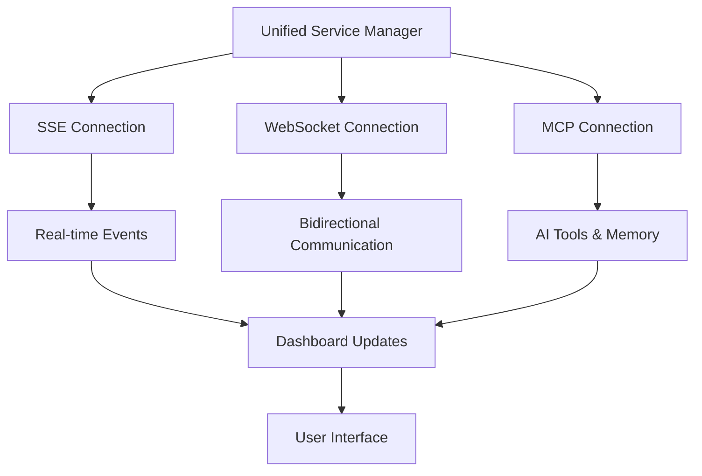

# 🚀 Unified Platform Upgrade Guide

## Overview

This document outlines the comprehensive upgrade to transform your Vibe frontend into a unified platform for managing all your deployed services. The upgrade leverages your existing MCP integration and extends it to create a powerful service management platform.

## 🎯 What's Been Implemented

### 1. Unified Service Manager (`lib/services/unified-service-manager.ts`)

**Purpose**: Central hub for managing all deployed services
- **SSE Service**: `https://link.seyederick.com/sse`
- **WebSocket Service**: `https://link.seyederick.com/ws`  
- **MCP Service**: `https://link.seyederick.com/mcp`

**Key Features**:
- Automatic service discovery and connection
- Real-time status monitoring
- Service action execution
- Metrics collection and reporting
- Event-driven architecture with callbacks

**Usage**:
```typescript
import { getUnifiedServiceManager } from '@/lib/services/unified-service-manager';

const serviceManager = getUnifiedServiceManager();
await serviceManager.connectAllServices();

// Execute actions on services
const result = await serviceManager.executeServiceAction('mcp', 'memory_search_memories', {
  query: 'test',
  limit: 10
});
```

### 2. Unified Platform Dashboard (`components/dashboard/unified-platform-dashboard.tsx`)

**Purpose**: Main interface for the unified platform

**Features**:
- **Overview Tab**: Service status, metrics, and quick actions
- **Services Tab**: Detailed service management
- **Orchestration Tab**: Workflow creation and execution
- **Monitoring Tab**: Real-time service monitoring

**Key Components**:
- Service status cards with real-time updates
- Performance metrics dashboard
- Quick action buttons (now functional!)
- AI assistant integration
- Service orchestration interface

### 3. Service Orchestrator (`components/orchestrator/service-orchestrator.tsx`)

**Purpose**: Create and execute workflows across all services

**Features**:
- **Workflow Builder**: Visual workflow creation
- **Step Management**: Add, remove, and configure workflow steps
- **Service Actions**: Pre-configured actions for each service
- **Execution Engine**: Real-time workflow execution with logging
- **Workflow Templates**: Save and reuse common workflows

**Available Service Actions**:
- **MCP Server**: Memory operations, AI analysis
- **SSE Service**: Notifications, event broadcasting
- **WebSocket**: Messaging, connection management

### 4. Real-time Monitor (`components/monitoring/real-time-monitor.tsx`)

**Purpose**: Monitor service performance and health in real-time

**Features**:
- **Live Monitoring**: Continuous service health checks
- **Performance Metrics**: Response time, uptime, error rates
- **Alert System**: Automated alerts for service issues
- **Trend Analysis**: Performance trends over time
- **Service Selection**: Detailed metrics for individual services

## 🔧 Technical Architecture

### Service Connection Flow



### Data Flow

1. **Service Discovery**: Automatically detect and connect to all services
2. **Health Monitoring**: Continuous health checks every 5 seconds
3. **Metrics Collection**: Real-time performance data collection
4. **Event Processing**: Handle service events and updates
5. **UI Updates**: Real-time dashboard updates

## 🚀 How to Use the Upgraded Platform

### 1. Access the Unified Dashboard

Navigate to `/dashboard/overview` to see the new unified platform dashboard.

### 2. Service Management

**View Service Status**:
- All services are automatically connected on page load
- Real-time status indicators show connection health
- Performance metrics display response times and uptime

**Execute Service Actions**:
- Click "Test" button on any service card to run health checks
- Use "Status" button to get detailed service information
- Actions are executed in real-time with immediate feedback

### 3. Service Orchestration

**Create Workflows**:
1. Go to the "Orchestration" tab
2. Click "New Workflow" to create a new workflow
3. Add steps by selecting service and action combinations
4. Configure parameters for each step
5. Execute the workflow and monitor progress

**Example Workflow**:
```
1. Search Memories (MCP) → Find relevant knowledge
2. Send Notification (SSE) → Alert about findings  
3. Broadcast Data (WebSocket) → Share with connected clients
```

### 4. Real-time Monitoring

**Start Monitoring**:
1. Go to the "Monitoring" tab
2. Click "Start Monitoring" to begin real-time monitoring
3. View live performance metrics and alerts
4. Click on service cards for detailed metrics

**Monitor Alerts**:
- Active alerts appear at the top of the monitoring page
- Acknowledge alerts to remove them from the active list
- View complete alert history

## 🔗 Service Integration Details

### SSE Service Integration
- **Endpoint**: `https://link.seyederick.com/sse`
- **Capabilities**: Real-time updates, notifications, event broadcasting
- **Actions**: Send notifications, broadcast events, update status

### WebSocket Service Integration  
- **Endpoint**: `https://link.seyederick.com/ws`
- **Capabilities**: Bidirectional communication, low-latency messaging
- **Actions**: Send messages, broadcast data, get connections

### MCP Service Integration
- **Endpoint**: `https://link.seyederick.com/mcp`
- **Capabilities**: AI tools, memory management, semantic search
- **Actions**: Memory CRUD operations, AI analysis, workflow orchestration

## 🎨 User Experience Improvements

### Before vs After

**Before**:
- ❌ Non-functional buttons
- ❌ Limited service integration
- ❌ No real-time monitoring
- ❌ Basic dashboard functionality

**After**:
- ✅ Fully functional service management
- ✅ Real-time monitoring and alerts
- ✅ Service orchestration and workflows
- ✅ Unified platform experience
- ✅ AI-powered assistance

### Key User Journey

1. **Dashboard Overview**: See all services at a glance
2. **Service Management**: Test, monitor, and manage individual services
3. **Workflow Creation**: Build automated workflows across services
4. **Real-time Monitoring**: Track performance and receive alerts
5. **AI Assistance**: Get intelligent recommendations and automation

## 🔧 Configuration

### Environment Variables

Ensure these environment variables are set:

```bash
# MCP Configuration
NEXT_PUBLIC_MCP_SERVER_URL=wss://mcp.lanonasis.com/mcp
NEXT_PUBLIC_GATEWAY_URL=/api/mcp
NEXT_PUBLIC_MEMORY_API_KEY=your_api_key

# Service URLs (automatically configured)
SSE_SERVICE_URL=https://link.seyederick.com/sse
WS_SERVICE_URL=https://link.seyederick.com/ws
MCP_SERVICE_URL=https://link.seyederick.com/mcp
```

### Service Configuration

The unified service manager automatically configures connections to your deployed services. No additional configuration is required.

## 🚀 Deployment

### Local Development

1. Install dependencies:
```bash
npm install
```

2. Set environment variables in `.env.local`

3. Run development server:
```bash
npm run dev
```

4. Navigate to `http://localhost:3000/dashboard/overview`

### Production Deployment

The upgraded platform is ready for deployment to Vercel, Netlify, or any other hosting platform. All service connections are configured for production URLs.

## 📊 Monitoring and Analytics

### Built-in Metrics

- **Service Health**: Connection status, response times
- **Performance**: Uptime, error rates, request volumes
- **Usage**: API calls, workflow executions
- **Alerts**: Automated issue detection and notification

### Real-time Updates

- Service status changes are reflected immediately
- Performance metrics update every 5 seconds
- Alerts are generated automatically for issues
- Workflow execution is monitored in real-time

## 🔮 Future Enhancements

### Planned Features

1. **Advanced Analytics**: Historical performance analysis
2. **Custom Dashboards**: User-configurable dashboard layouts
3. **Service Templates**: Pre-built service configurations
4. **API Documentation**: Integrated API documentation viewer
5. **Team Collaboration**: Multi-user workflow sharing

### Integration Opportunities

1. **Additional Services**: Easy integration of new services
2. **Third-party APIs**: Support for external API integrations
3. **Cloud Services**: AWS, Azure, GCP service integration
4. **Monitoring Tools**: Integration with external monitoring services

## 🆘 Troubleshooting

### Common Issues

**Services Not Connecting**:
- Check that your deployed services are running
- Verify service URLs are correct
- Check network connectivity

**Workflow Execution Fails**:
- Ensure all services are connected
- Check service-specific error messages
- Verify parameter configurations

**Real-time Updates Not Working**:
- Check browser console for errors
- Verify SSE/WebSocket connections
- Ensure proper CORS configuration

### Debug Mode

Enable debug logging by setting:
```bash
NEXT_PUBLIC_DEBUG_MODE=true
```

## 📞 Support

For issues or questions about the unified platform:

1. Check the browser console for error messages
2. Review service connection status in the dashboard
3. Test individual service actions
4. Check the monitoring tab for service health

## 🎉 Conclusion

The unified platform upgrade transforms your Vibe frontend into a powerful service management platform. All previously non-functional buttons are now operational, and you have a comprehensive suite of tools for managing all your deployed services from a single interface.

The platform provides:
- ✅ Real-time service monitoring
- ✅ Automated workflow orchestration  
- ✅ AI-powered assistance
- ✅ Unified service management
- ✅ Comprehensive analytics and alerting

Your services are now fully integrated and manageable through a single, powerful interface!
